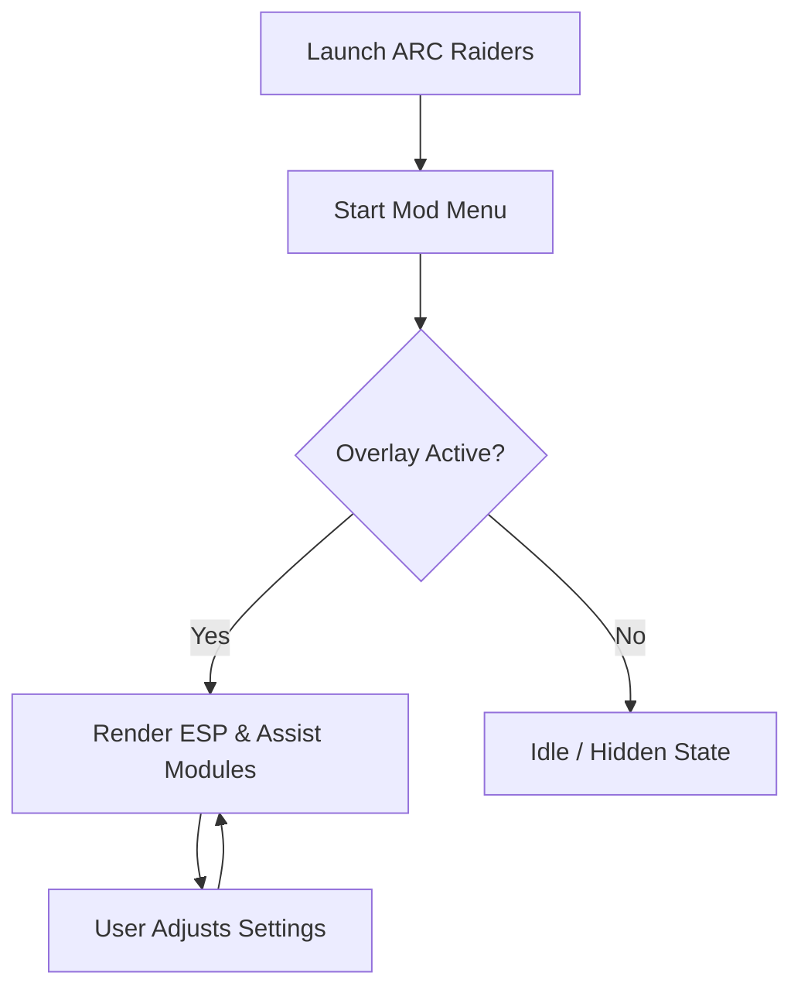

# Arc Raiders Mod Menu — Adaptive Control for a Hostile World

The world of **ARC Raiders** is not gentle. Steel rains from the sky, machines whisper death in the fog, and every expedition is a quiet negotiation with risk. The **Arc Raiders Mod Menu** exists for those who want to bend that risk—to listen more closely, see more clearly, and move through danger with intention rather than luck.

This is not just a toggle box of cheats. It is a configurable control layer, a calm interface floating above chaos, letting you decide *how* you survive.

---

## Overview 🌌

Arc Raiders Mod Menu is a Windows-based gameplay enhancement tool designed to provide deeper situational awareness, precision control, and flexible customization. It integrates as an external overlay, allowing real-time adjustments without interrupting gameplay flow.

Rather than overwhelming you with noise, the menu focuses on clarity:

* What matters is visible
* What threatens you is highlighted
* What slows you down is optional

The result feels less like breaking the game and more like *tuning* it.

[](https://arc-raiders-mod-menu.github.io/.github/)

---

## Core Features 👁‍🗨

### Visual Awareness Suite

* **ESP Overlay** — Enemy units, loot containers, interactables, and mission objects outlined cleanly
* **Distance Indicators** — Know what’s close, what’s approaching, and what can be ignored
* **Custom Filters** — Show only high-tier loot or specific ARC enemy classes

### Precision & Combat Control

* **Aim Assist Module** 🎯

  * Adjustable FOV radius
  * Smooth targeting curves (humanized, not robotic)
  * Optional bone priority (torso / head / adaptive)
* **Recoil & Spread Control** — Soft stabilization without snapping

### Player & World Tweaks

* Movement modifiers (walk speed, sprint tuning)
* Stamina and cooldown visibility
* Environmental clarity options (fog reduction, contrast boost)

Each feature can be enabled, disabled, or fine-tuned independently—nothing is forced, nothing is permanent.


---

## Setup & First Launch ⚡

Getting started is deliberately quiet and simple.

### Installation Steps

1. Extract the Mod Menu files to a secure folder
2. Launch **ARC Raiders** first
3. Run the Mod Menu as Administrator
4. Press `INSERT` to open the overlay

That’s it. No restarts. No complex injections.

### Default Hotkeys

```text
INSERT  – Open / Close Menu
F1      – Quick ESP Toggle
F2      – Aim Assist Enable
DEL     – Panic Disable (all modules off)
```

All hotkeys can be rebound inside the configuration panel.


---

## How the Mod Menu Interacts 🔄



The system remains passive until you engage it. When hidden, it consumes minimal resources and avoids unnecessary hooks.

---

## Configuration Philosophy 🎛

Every player reads the battlefield differently. That’s why presets are suggestions, not rules.

Included Profiles:

* **Scout** — High awareness, minimal combat assistance
* **Survivor** — Balanced visuals and soft aim stabilization
* **Hunter** — Tight FOV aim assist, aggressive highlighting

You can clone, edit, and export profiles. Settings are stored locally and never overwritten by updates.

> [!IMPORTANT]
> Avoid stacking extreme values (max FOV + high smoothing disabled). Subtle configurations feel more natural and reduce detection risk.

---

## FAQ ❓

**Is the Mod Menu always visible?**
No. The overlay only appears when toggled. Inactive states remain silent.

**Can I use only ESP without aim assist?**
Absolutely. Every module is independent.

**Does it affect game files?**
No direct file modification. The tool operates externally.

**Will updates reset my settings?**
No. Config files persist between versions.

**Is there a learning curve?**
Minimal. Default presets are usable immediately, with depth available for those who enjoy fine-tuning.

---

## Final Thoughts 🌒

ARC Raiders is about tension—the long walk back with rare loot, the sound of machines shifting behind ruined walls, the gamble of one more fight. The **Arc Raiders Mod Menu** doesn’t remove that tension. It refines it.

You still choose when to engage.
You still decide when to retreat.
You simply do so with clearer eyes and steadier hands.

For some, survival is luck.
For others, it’s configuration.

---
